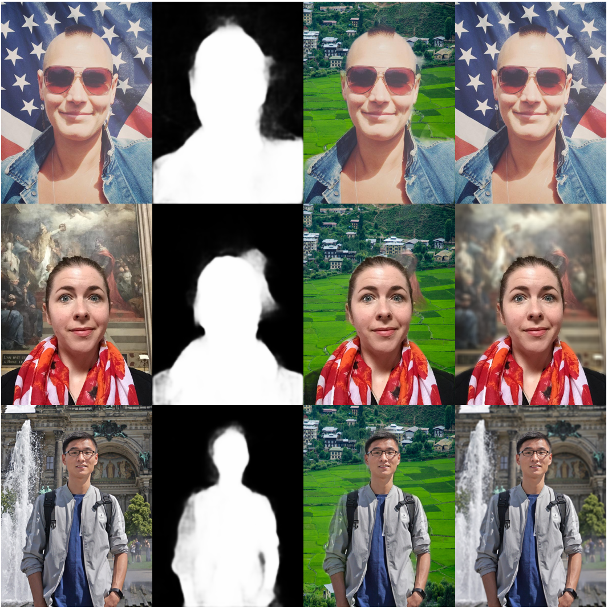

# PortraitNet Implementation in PyTorch with Python3

Code for the paper ["PortraitNet: Real-time portrait segmentation network for mobile device".](https://www.sciencedirect.com/science/article/pii/S0097849319300305)


## My Results

<div align="center">

<p> From left to right: input, segmentation mask, background replacement, background bluring.</p>
</div>

---
## Get Started

### Environment Requirements
- python 3.8
- PyTorch 1.10.1+cu111
- pip install easydict matplotlib tqdm opencv-python scipy pyyaml numpy


### Download datasets
- [EG1800](https://pan.baidu.com/s/1myEBdEmGz6ufniU3i1e6Uw) Since several image URL links are invalid in the [original EG1800 dataset](http://xiaoyongshen.me/webpage_portrait/index.html), we finally use 1447 images for training and 289 images for validation. 

- [Supervise-Portrait](https://pan.baidu.com/s/1uBtCsLj156e_iy3DtkvjQQ) Supervise-Portrait is a portrait segmentation dataset collected from the public human segmentation dataset [Supervise.ly](https://supervise.ly/) using the same data process as EG1800.

---

### Demo
Please modify the input image file path and the background image file path in the demo.py file. Then run the following command:
```bash
python demo.py
```

### Training
- Download the datasets (EG1800 or Supervise-Portriat). If you want to training at your own dataset, you need to modify data/datasets.py and data/datasets_portraitseg.py.
- Prepare training/testing files, like data/select_data/eg1800_train.txt and data/select_data/eg1800_test.txt.
- Select and modify the parameters in the folder of config.
- Start the training with single gpu:
```
cd myTrain
python train.py
```

## References
- [PortraitNet](https://github.com/dong-x16/PortraitNet).